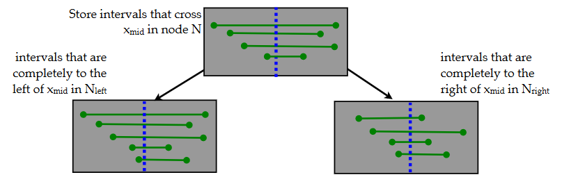
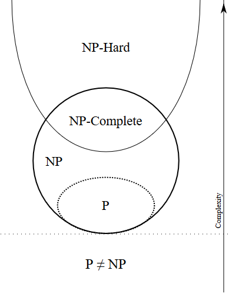

# Algorithm questions

## What are ways to traverse a tree?

Tree traversals can be classified into breadth-first traversal and depth-first traversal.

Breadth-first traversal visits all nodes of one level before proceeding with the next level.

Depth-first traversal visits the children of a node before proceeding to the next node.
There are three variants of depth-first traversal:

| Traversal | Order |
| --- | --- |
| Pre-order | `root -> left -> right` |
| In-order | `left -> root -> right` |
| Post-order | `left -> right -> root` |

## How does an interval tree work?

An interval tree is a sorted tree data structure that contains intervals.
It allows to quickly retrieve all intervals a given point is part of.
It is constructed as follows:

1. Sort the intervals using their start values.
2. For each interval, compute the median.
3. Build the tree based on the median vales. 
   All intervals that contain a certain median value are stored in one node. 
   All points in the intervals on the left are smaller than the median, all points in the intervals on the right are greater than the median.

At search time, if a query value is smaller than the median, the right subtree can be discarded.
If a query value is larger than the median, the left subtree can be discarded.

## How does bubble sort work?

Bubble sort repeatedly iterates through the list, compares adjacent elements, and swaps them if they are not ordered.
The algorithm terminates once there are no swapping operations in an iteration.

### What is heapsort?

Heapsort is an in-place sorting algorithm.
It first uses Floyd's algorithm to construct a max-heap and then iteratively performs the following steps:

1. Store the maximum element in a temporary variable.
2. Erase the maximum element from the heap and reorder the heap.
3. Insert the value of the temporary variable at the position after the heap.

Computational complexity is O(n log(n)).

## How does Floyd's algorithm work?

Given an unsorted array, Floyd's algorithm iterates over the elements from end to start.
To each element, it applies the sift-down operation.
Computational complexity is O(n log(n)), but can be proven to be bounded by O(n) upon closer inspection.

## How to distinguish between P, NP, NP-hard, and NP-complete?

P, NP, NP-hard, and NP-complete are classifications that pertain to the complexity of a mathematical problem.
They are defined as follows:

| Complexity class | Description |
| --- | --- |
| P | All problems that can be solved in polynomial time. |
| NP | All problems that can be verified in polynomial timme. |
| NP-hard | Problems to which all NP problems can be transformed in polynomial time. |
| NP-complete | Intersection of NP-hard and NP-complete. |

### How does gradient descent work?

In order to find the minumum of a function, gradient descent repeats the following steps until a convergence criterion is fulfilled:

1. Compute the gradient of the function at the current position.
2. Move in the direction of the gradient.

### How does the Gauss-Newton algorithm work?

In order to find the minimum of a function, the Gauss-Newton algorithm repeatedly performs the following steps until convergence:

1. Compute the first-order and second-order derivatives of the function at the current position.
2. Fit a quadratic approximation of the function to the function value and the derivatives.
3. Set the current position to the minimum of the quadratic function.

### What is the Levenberg-Marquardt algorithm?

The Levenberg-Marquadt algorithm is an least-squares minimization algorithm that combines gradient descent and the Gauss-Newton algorithm.
When far from the optimum, the algorithm behaves more like gradient descent.
When close to the optimum, the algorithm behaves more like Gauss-Newton.
