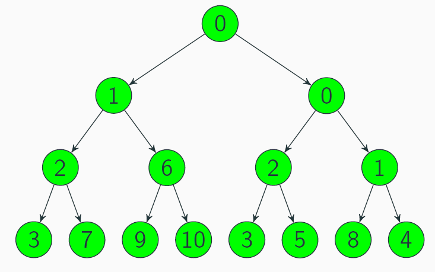
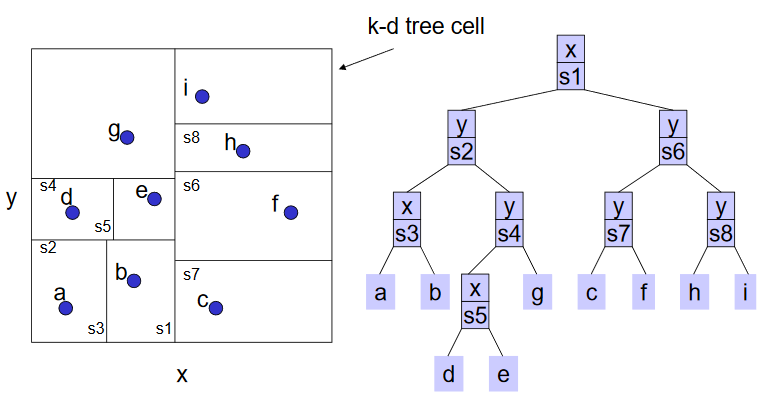

# Data structures

## Heap

A heap is a partially ordered tree data structure that satisfies the heap property:
In a min-heap, the parent node is smaller or equal than its children.
In a max-heap, the parent node is greater or equal than its children.
Heaps can be stored as arrays.

Computational complexity:

* Deletion of root, followed by insertion of last element and sift-down: O(log n)
* Insertion at end and sift-up: O(log n)
* Construction via Floyd's algorithm: O(n)

## k-D tree

A k-D tree is a binary tree data structure used to represent points in space.
It is used for nearest-neighbor and range searches.

Steps to construct a k-d tree:

1. If there is just one point, form a leaf with that point.
2. Otherwise, divide the points in half by a line perpendicular to one of the axes.
   Choose the axis along which the points exhibit the widest spread.
3. Recursively construct k-D trees for the two remaining sets of points.
