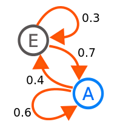
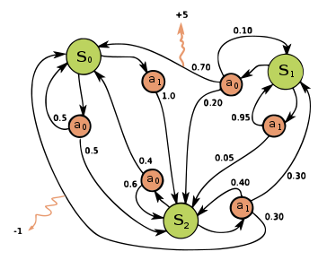
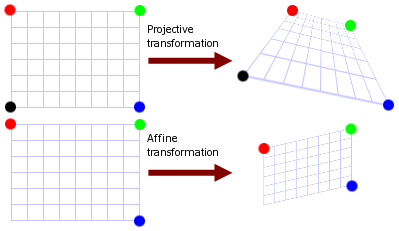

# Robotics questions

## General

### What is the Jacobian?

The Jacobian matrix represents the partial derivatives of a vector-valued function w.r.t. the function arguments.
It is ordered as follows:

```
df1 / dx1   df1 / dx2   ...
df2 / dx1   df2 / dx2   ...
...
```

### What is the Hessian?

The Hessian matrix represents the second derivatives of a scalar function in matrix form.
The matrix is ordered as follows:

```
d^2f / (dx1 dx1)   d^2f / (dx1 dx2)   d^2f / (dx1 dx3)   ...
d^2f / (dx2 dx1)   d^2f / (dx2 dx2)   d^2f / (dx2 dx3)   ...
d^2f / (dx3 dx1)   d^2f / (dx3 dx2)   d^2f / (dx3 dx3)   ...
...
```

## Probabilistics

### What is the Bayes filter?

The Bayes filter is a probabilistic filter that models the probability distribution of a latent variable given incoming measurements via recursive updates.
It consists of two steps:

1. Prediction
2. Innovation

If the variables are normally distributed and the transitions are linear, the Bayes filter is equal to the Kalman filter.
The particle filter is a non-parametric approximation of the Bayes filter.

### What is expectation maximization?

Expectation maximization is a method for maximum-likelihood estimation in presence of latent variables.
A typical application is to estimate the parameters of a Gaussian mixture model from ungrouped input data.
The algorithm follows the steps below:

1. Start with an initial estimate of the parameters to be estimated.
2. Expectation: Compute the weights that tell for combination of data point and parameter the probability that the data point was produced by the parameter.
3. Maximization: Update the parameters using the weighted input data.
4. Repeat steps 2 and 3 until convergence.

### What is a Gaussian mixture model?

A mixture model is a probabilistic model that represents subpopulations within an overall population.
In the case of the Gaussian mixture models, the probability densities of the subpopulations follow a Gaussian distribution.
The overall probability density is computed by summing up the probability densities of all subpopulations.

### What is a marginal distribution?

A marginal distribution is a distribution of a subset of a collection of random variables that was produced via marginalization.
The random variables not contained in the subset have been marginalized out via the law of total probability.

### What is a Markov random field?

A Markov random field is a probabilistic model described by an undirected graph.
The nodes represent random variables, the edges represent Markov relations.

### What is a Markov blanket?

The Markov blanket of a node in a graphical model is the set of nodes that shield the node from the rest of the network.
The Markov blanket of a node is the only knowledge required to predict the behavior of the node and its children.

### What is a Markov chain?

A Markov chain is a discrete-time stochastic model that describes a sequence of possible events and their transition probabilities.
Each event depends only on its immediate predecessor.
No knowledge about earlier events is required to predict later events.



### What is a Markov process?

A Markov process is the continuous-time variant of a Markov chain.

### What is a hidden Markov model?

A hidden Markov model is a Markov process with hidden, unobservable random variables.
Given a sequence of observed states, one can estimate the most probable sequence of hidden states.

### What is a Markov decision process?

Markov decision processes model discrete-time processes that are partly random, but can be influenced by actions taken.
At each time step, the decision maker may choose an action that is available in the current state.
The process responds at the next time step by randomly moving to a new state, giving the decision maker a corresponding reward.



### What is the value iteration process?

Given a certain time horizon, the value iteration process tells which sequence of actions to take in a Markov decision process in order to maximize the reward.

### What is a POMDP?

POMDP stands for partially observable Markov decision process.
So the problem shifts from finding a mapping from states to actions (as in a regular Markov decision process) to finding a mapping from a probability distribution over states to actions.
For more detailed information about POMDPs, see [this tutorial](img/http://cs.brown.edu/research/ai/pomdp/tutorial/index.html).

### What is a Gaussian process?

Gaussian processes are a supervised learning technique for regression and classification.
They model the value of the dependent variables as a linear combination of the independent variables.
They assume the coefficients of the independent variables are normally distributed.
This allows to assign a posterior probability to each value of the dependent variables.
In order to model nonlinear relations between dependent and independent variables, the independent variables are projected into a high dimensional space, for example the space of powers (1, x, x^2, x^3, ...).

## Path planning

### What is Dijkstra's algorithm?

Dijkstra's algorithm is an algorithm for finding the shortest path in an undirected graph with edges that represent positive cost.
It iterates the following steps:

1. Given the cost it took to get to the current node, compute the cost to get to each of the neighboring nodes that have not been visited yet.
2. If the cost to get to any neighboring node is smaller than previously computed, update the cost.
3. Choose the node with the least transition cost as the next node.

Once all relevant nodes have been visited, the shortest path can be reconstructed by looking up the predecessors of the nodes.
To that end, it is necessary to maintain the following table while performing the algorihm:

| Vertex | Visited | Cost | Predecessor |
| --- | --- | --- | --- |
| A | Yes | 0 | - |
| B | No | Inf | - |
| C | No | 15 | E |
| ...

Dijkstra's algorithm always finds the optimal solution.

### What is the A* algorithm?

The A* algorithm is an extension of Dijkstra's algorithm designed to improve runtime by not processing all nodes in a graph.
To that end, the algorithm uses a heuristic that tells for each node an estimate of the distance between the node and the goal.
This heuristic guides the selection of the next node.
It must never overestimate the cost.
The next node is always the node that minimizes the F-value, where F = G + H.
F is the expected overall cost, G is the cost to get to this node, and H is the estimated cost to get from this node to the goal.

### What is CHOMP?

CHOMP is a trajectory optimization technique that trades off between trajectory smoothness and obstacle avoidance.

## Computer vision

### What is a homography?

A homography is a geometric transformation that maps the points in one image to another image.
A homography is represented by a 3x3 transformation matrix.
The transformation matrix encodes rotation (`a`), translation (`b`), and projection (`c`):

```
/ a1  a2  b1  \
| a3  a4  b2  |
\ c1  c2   1  /
```

### What is the difference between affine and projective transformations?

Both affine and projective transformations can be represented by a 3x3 transformation matrix.

For projective transformations, the projective part of the matrix is non-zero. 
As a consequence, projective transformations do not preserve parallelism, length, and angle.

For affine transformations, the projective part of the matrix is zero. 
Consequently, affine transformations preserve parallelism.
They do not preserve length and angle, though.



### What are intrinsic camera parameters?

Intrinsic camera parameters for the pinhole model describe the mapping from image coordinates to rectified image coordinates.
The transformation is described by a 3x3 transformation matrix:

```
/ fx   s  cx \
|  0  fy  cy |
\  0   0   1 /
```

Here, `fx` and `fy` are the focal length in pixels, `s` is the skew coefficient, and `cx` and `cy`  describe the offset of the principal point.

For more information, see [this post](img/http://ksimek.github.io/2013/08/13/intrinsic/).

### What is gated imaging?

Gated imaging involves an active camera.
That means, the camera is connected to a light source that illuminates the target.
By capturing light only during a specified interval after triggering the light source, gated imaging can provide a depth slice of the scene.
In this way, the camera can "look through" obscurants like rain, snow, or dust.

## Machine learning

### What is the difference between a discriminative and a generative model?

A discriminative model assigns labels to given input data.
A generative model creates input data that corresponds to a given label.
